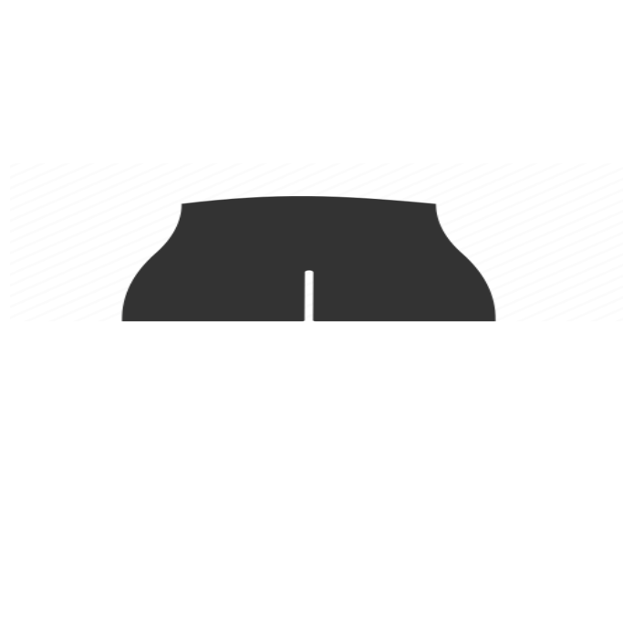

NOBODY want's your complicated fur-lined syruppy-picture AI.  
============================================================

PRACTICAL troubleshooting ... the depths of artificial intelligence is all about CLEAVAGE ... if you want to solve a problem, you must start by removing, CLEAVING, hack stuff out of the away to get down to where the VALUE is ... the Big V is about what makes the s*** you need to look at actually happen.

Do not repeat the excesses of other AI approaches ... *remove*, **Remove,** ***REMOVE*** 

After you have understood ... THEN you can think about cleaning it up, polishing and making it extra CLEAN, shiny and MAINTAINABLE.

Welcome to the Plumbers creVass!
================================
People want to crap in something that is CLEAN, tightly refactored and and something that can get even CLEANER with more use.

You have to get down into the deep Whys of why things happen ... or, else you're just fuzzying up your networks of neurotic neurosis ... putting your diffuser bandaid on things does not reveal anything -- you're transforming the problem into a more impenetrable clusterfuck of complexification ... it might be ugly, but somebody is going to have to clean up the mess you  made!

GET DOWN INTO THE INTERNALS.

Stop making it worse with your ARTIFICIAL intelligence ... everyone can see your intelligence is completely artificial ... knock it the fuck off with the obfuscations already.

.. toctree:: 
    :maxdepth: 2

    about.rst
    getting-started.rst
    cli-guide.rst

.. toctree::
   :maxdepth: 3

   surround.rst
